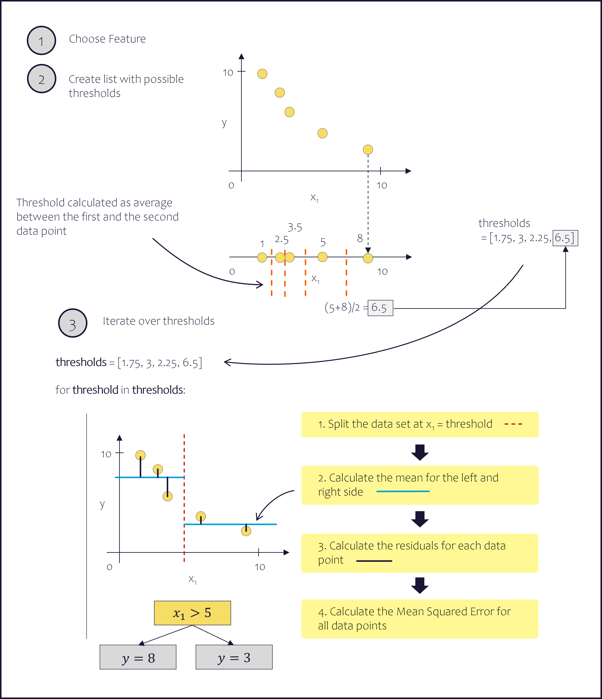

# Decision Tree from Scratch

This repo contains code snippets and datasets used in my Medium article "Tree-based Algorithms - Decision Trees, the Core of Random Forest, XGBoost and Co."

## Used Libraries and Tools

* Python: 
  * Pandas
  * Scikit-learn
  * Numpy
  
## License
[MIT](https://choosealicense.com/licenses/mit/)
